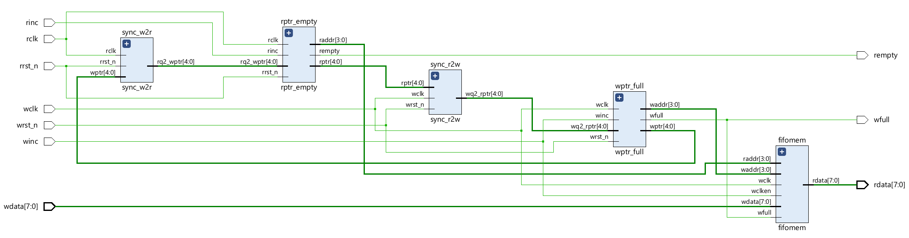

### **Introduction**

An asynchronous First-In, First-Out (FIFO) buffer is a memory unit used to safely transfer multi-bit data words from one clock domain to another, where the two clock domains are asynchronous to each other. Data is written into the FIFO buffer controlled by signals in the write clock domain and read from the same buffer by signals from the read clock domain.

The primary challenge in asynchronous FIFO design lies in reliably generating the write and read pointers and determining the 'full' and 'empty' status of the buffer. While many designs may appear to function correctly most of the time, subtle design flaws can lead to catastrophic failures that are exceptionally difficult to detect and debug. An incorrect implementation can cause synchronization and comparison problems that are nearly impossible to observe in standard RTL simulation and may only surface in gate-level simulations with back-annotated delays.

This paper details a robust method for designing, synthesizing, and analyzing a safe asynchronous FIFO. The core of this technique involves using Gray code pointers, which are synchronized into the opposite clock domain before being used to test for "FIFO full" or "FIFO empty" conditions.

### **FIFO Design Principles and Implementation Details**

#### **Read/Write Operations**

The operation of the FIFO is managed by two main pointers: a write pointer (`wptr`) and a read pointer (`rptr`).

- **Write Pointer (`wptr`)**: This pointer always indicates the next memory location to be written. Upon a write operation (`winc`), the data word (`wdata`) is stored at the location pointed to by `wptr`, and the pointer is then incremented to the next available location.
- **Read Pointer (`rptr`)**: This pointer always points to the current data word available to be read. This design choice is efficient, as it allows the receiving logic to read a valid data word in a single clock cycle without first having to increment the pointer. When the first data word is written to an empty FIFO, the `rempty` flag is cleared, and the read pointer, which is still at the first location, immediately drives the valid word to the data output port (`rdata`).
- **Reset Condition**: On reset, both the read and write pointers are initialized to zero.

#### **Full/Empty/Wrapping Conditions**

Determining the full and empty states of the FIFO is critical but complicated by the fact that in a simple implementation, the pointers are equal for both conditions.

- **Empty Condition**: A FIFO is considered empty when the read and write pointers are equal. This occurs either at reset or when the read pointer has read the last word and "catches up" to the write pointer.
- **Full Condition**: A FIFO is full when the write pointer has filled the buffer, wrapped around, and once again "caught up" to the read pointer, making the pointers equal.

To distinguish between these two states, a common technique is to add an extra bit to each pointer, making them one bit wider than what is required to address the memory depth. For a FIFO with $2^{n−1}$ locations, n-bit pointers are used.

- When a pointer increments past the last address, its most significant bit (MSB) is toggled.

- The FIFO is  **empty** when all bits of the pointers, including the MSBs, are identical. This indicates both pointers have wrapped around the same number of times.

- The FIFO is **full** when the MSBs of the pointers are different, but the remaining lower bits are identical. This indicates the write pointer has wrapped around one more time than the read pointer.

  

#### **Gray Code Counter**

Using standard binary counters for pointers in an asynchronous design is problematic because multiple bits can change simultaneously (e.g., from binary 0111 to 1000). Attempting to synchronize such a multi-bit value across clock domains can lead to incorrect values being captured.

To solve this, Gray code counters are used. The defining characteristic of a Gray code is that only one bit changes between any two consecutive values. This property eliminates the problem of synchronizing multiple changing signals across a clock boundary.

The design presented uses a Gray code counter which employs two sets of registers:

1. A binary register that is used for incrementing and directly addressing the FIFO RAM/memory.

2. A Gray code register, derived from the binary value, which is used for the pointer that gets safely synchronized into the opposite clock domain, using simple two flip-flop synchronizers.

   

#### **Signal Definition**s

The key signals involved in this FIFO design are:

- `wclk`, `rclk`: The asynchronous write and read clocks.
- `wrst_n`, `rrst_n`: Active-low asynchronous reset signals for the write and read domains.
- `winc`, `rinc`: Control signals to initiate a write or read operation.
- `wdata`, `rdata`: The data input and output buses.
- `wfull`, `rempty`: Status flags indicating if the FIFO is full or empty.
- `wptr`, `rptr`: The n-bit Gray code pointers generated in the write and read domains, respectively. These are used for synchronization.
- `waddr`, `raddr`: The (n-1)-bit binary pointers used to address the physical FIFO memory.
- `rq2_wptr`: The write pointer (`wptr`) after being synchronized into the read clock domain (`rclk`).
- `wq2_rptr`: The read pointer (`rptr`) after being synchronized into the write clock domain (`wclk`).

### **Structure of the Verilog Files**

The design is carefully partitioned into six distinct Verilog modules, with boundaries drawn along clock domains.

- **`fifo.v`**: This is the top-level wrapper module that instantiates all the other sub-modules. It connects the different clock domain blocks but would likely be discarded in a larger system design to allow for better grouping of logic by synthesis tools.

- **`fifomem.v`**: This module represents the FIFO's physical memory, typically an instantiated dual-port synchronous RAM. It is accessed by both the write and read clock domains.

- **`sync_r2w.v`**: This is a simple synchronizer module that passes the read pointer (`rptr`) from the read-clock domain to the write-clock domain. It consists of a chain of registers clocked exclusively by `wclk` to safely transfer the pointer value.

- **`sync_w2r.v`**: Symmetrical to `sync_r2w.v`, this module synchronizes the write pointer (`wptr`) from the write-clock domain into the read-clock domain. It contains only registers clocked by `rclk`.

- **`rptr_empty.v`**: This module contains all logic that is synchronous to the read clock (`rclk`). It includes the read pointer generation logic and the comparison logic to generate the `rempty` flag. The `rempty` flag is asserted when the next value of the read pointer will equal the synchronized write pointer (`rq2_wptr`).

- **`wptr_full.v`**: This module contains all logic synchronous to the write clock (`wclk`). It is responsible for generating the write pointer and the `wfull` flag. The `wfull` flag is asserted based on a comparison between the next value of the write pointer and the synchronized read pointer (`wq2_rptr`).

- **`fifo_tb.v`**: This testbench verifies an asynchronous FIFO using two different clock speeds for the read and write domains. The main tests include a simple write-then-read sequence.

### Citations

[1] C. E. Cummings, “Simulation and Synthesis Techniques for Asynchronous FIFO Design,” in *SNUG San Jose 2002 User Papers*. Sunburst Design, Inc., rev. 1.2, Jun. 2005.

### Code

GitHub URL: https://github.com/zsh-is-life/async_fifo
